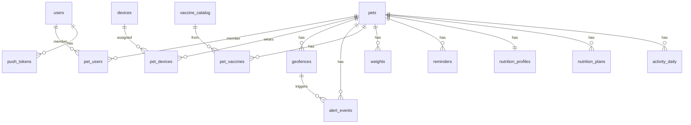

# Data model — pet-tracker

> Fuente: modelo del plan 001 (`plans/001-paquete-diseno-aprobacion.md` §Paso 4),
> derivado del brief (`docs/brief.md` §4, §7, §15–17), **adaptado a desarrollo
> 100% local** (decisiones 2026-07-29):
>
> - **Dominio: PostgreSQL 17** en Docker (el plan asume Aurora Serverless v2;
>   misma SQL, distinta operación — el código no cambia).
> - **Telemetría GPS: DynamoDB en LocalStack** (tabla `positions`), fiel al plan.
> - **Auth propia (JWT + hash de password)** en vez de Cognito: LocalStack
>   community no emula Cognito. `users` cambia `cognito_sub` por
>   `password_hash`. El guard conserva el contrato del plan (`@CurrentUser()`),
>   así el swap a Cognito en un deploy real solo toca el módulo auth.
>
> Referencia viva: cada feature formaliza su slice en `specs/<feature>/` y la
> migración Drizzle correspondiente. Este documento se actualiza cuando una
> migración real agrega o cambia tablas.

## ERD (dominio Postgres)

## Catálogo de tablas (PostgreSQL)

Convención: snake_case, PK `uuid` (UUIDv7 generado en app) salvo indicado,
`timestamptz` para instantes, `date` para fechas de calendario.

| Tabla | Columnas clave | Notas |
|---|---|---|
| `users` | id PK, email UNIQUE NOT NULL, **password_hash NOT NULL**, first_name, last_name, phone, country, timezone DEFAULT 'UTC', terms_accepted_at timestamptz NOT NULL, email_verified_at timestamptz NULL, created_at, updated_at | Adaptación local: sin `cognito_sub`. `terms_accepted_at` = momento de aceptación de términos y aviso de privacidad (brief §6), obligatorio en el registro. `email_verified_at` NULL hasta confirmar por código/enlace (brief §6); token/expiración se modela en `auth-registration` (#3) — sin SES/Cognito en local, se loguea en vez de enviarse (ver architecture.md). No hay columna para `passwordConfirmation` porque es solo validación de DTO, nunca se persiste |
| `email_verification_tokens` | id PK, user_id FK CASCADE, token_hash char(64) UNIQUE NOT NULL, expires_at timestamptz NOT NULL, used_at timestamptz NULL, created_at | Creada por `auth-registration` (#3). Solo se guarda el SHA-256 hex del token de un solo uso — el valor en claro nunca se persiste (ver `specs/auth-registration/design.md`). `used_at` no nulo = ya consumido, no reutilizable |
| `pets` | id PK, name, species CHECK ('dog','cat'), breed, birth_date, approx_age_months, sex, current_weight_kg numeric(5,2), size, color, sterilized, microchip, photo_key, lost_mode DEFAULT false, last_position jsonb, last_communication_at | `last_position` = caché desnormalizada; la serie vive en DynamoDB |
| `pet_users` | PK (pet_id, user_id), role CHECK ('owner','family','walker','vet'), permissions jsonb, status DEFAULT 'active' | **Toda autorización pasa por aquí** (brief §4) — `PetAccessGuard` |
| `devices` | id PK, esn UNIQUE, imei UNIQUE, serial_number, activation_code, wialon_unit_id UNIQUE, model, status CHECK ('available','assigned','inactive'), battery_pct, connectivity, last_message_at, ingest_watermark, is_simulated | Collares; seed simulado SIM-001..003 |
| `pet_devices` | id PK, pet_id FK, device_id FK, assigned_at, released_at NULL | Índice único parcial `(device_id) WHERE released_at IS NULL` — un collar activo por mascota |
| `geofences` | id PK, pet_id FK CASCADE, name, type CHECK ('safe_circle','safe_polygon','restricted','home','park','vet','daycare'), geometry jsonb, active DEFAULT true, geofence_state jsonb | `geofence_state` = `{state, updatedAt}` del motor (plan 007) |
| `alert_events` | id PK, pet_id FK, geofence_id FK NULL, type, status CHECK ('open','acked','closed'), payload jsonb, opened_at, acked_at, closed_at | Índice único parcial anti-spam: `(pet_id, type, coalesce(geofence_id, uuid_nil)) WHERE status='open'` (brief §12) |
| `vaccine_catalog` | id PK, species, name, scheme jsonb, UNIQUE(species,name) | Esquema orientativo de dosis/refuerzos en meses |
| `pet_vaccines` | id PK, pet_id FK, catalog_id FK NULL, name, applied_at date, next_dose_at date NULL, vet_name, clinic, notes, document_key, created_by FK | `name` libre a propósito (lectura IA post-MVP) |
| `weights` | id PK, pet_id FK, weight_kg numeric(5,2), body_condition CHECK (1..9), measured_at date, created_by FK | Actualiza `pets.current_weight_kg` si es la más reciente |
| `reminders` | id PK, pet_id FK, type ('vaccine','deworming','medication','appointment','weight','food','custom'), title, due_at, advance_minutes DEFAULT 60, channel DEFAULT 'push', status ('scheduled','sent','cancelled'), schedule_name NULL, created_by FK | Programación local: ver deviación en architecture.md (EventBridge Scheduler no está en LocalStack community) |
| `nutrition_profiles` | pet_id PK FK, activity_level ('low','medium','high'), body_condition, target_weight_kg, food_type, kcal_per_100g numeric(6,1), allergies jsonb, diseases jsonb, updated_at | 1:1 con mascota |
| `nutrition_plans` | id PK, pet_id FK, rer_kcal, mer_kcal, daily_grams, meals_per_day, meal_times jsonb, objective, warnings jsonb, ai_explanation NULL, inputs_hash, generated_at | `inputs_hash` = idempotencia (no re-llamar a la IA sin cambios) |
| `push_tokens` | id PK, user_id FK CASCADE, expo_token UNIQUE, platform, created_at, last_seen_at | En local el notifier corre `PUSH_ENABLED=false` (solo log) |
| `audit_log` | id bigint identity PK, user_id NULL, action, entity, entity_id, meta jsonb, at DEFAULT now() | Brief §19 |
| `activity_daily` | PK (pet_id, date), distance_m, active_minutes, rest_minutes, walk_count, avg_walk_minutes, first_walk_at, last_walk_at, time_away_minutes NULL, computed_at | KPIs diarios (plan 006); `time_away_minutes` se llena con geocercas (007) |

Índices además de los implícitos: toda columna FK lleva índice manual
(Postgres no indexa FKs), compuestos `(pet_id, <fecha> DESC)` en historial,
parcial `reminders(due_at) WHERE status='scheduled'`.

## DynamoDB (LocalStack) — telemetría

**Tabla `positions`** — acceso siempre por mascota + rango temporal; volumen
(~2 880 posiciones/día/mascota a 30 s) incompatible con el Postgres barato.

| Atributo | Valor |
|---|---|
| PK `pk` | `PET#<petId>` |
| SK `sk` | epoch ms del dispositivo (number) |
| Atributos | lat, lng, speed_kmh, course, altitude, sats, accuracy_m, battery_pct, device_ts, received_ts, processed_ts, flags (['suspect_jump','low_accuracy',…]) |
| TTL | `expires_at` = device_ts + 90 días |
| Idempotencia | PutItem sobre el mismo `sk` sobrescribe — reintentos seguros |

`ws_connections` (plan 010, post-MVP) queda fuera del alcance actual.

## Decisiones y triggers de desviación

- **Postgres dominio / DynamoDB telemetría**: revisada 2026-07-29 al
  reconciliar con `plans/` — sustituye la decisión M0 inicial de guardar GPS
  en Postgres. El pipeline de ingesta (plan 005) escribe en DynamoDB desde el
  día uno para no reescribirlo después.
- Consultas geoespaciales ricas (radio, cercanía) → PostGIS (aditivo).
- Deploy real futuro: Postgres → RDS/Aurora vía connection string; DynamoDB
  LocalStack → DynamoDB real; auth propia → módulo swap a Cognito.
