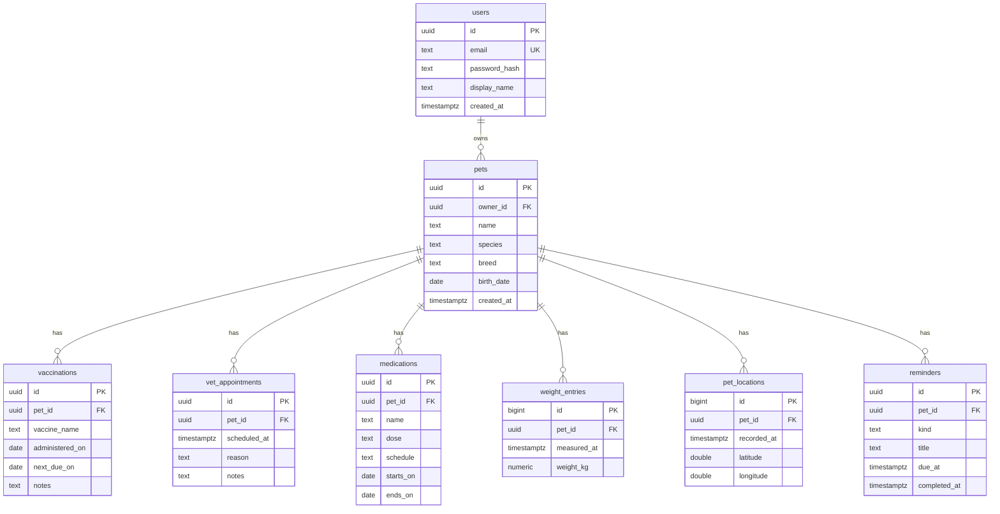

# Data model — pet-tracker

> Decisión M0 (selección de engine) tomada el 2026-07-29 vía `/claude-db:design`.
> Modelo starter de referencia — cada feature formalizará su parte en su spec
> y la primera migración real saldrá de ahí. No es una migración ejecutable.

## Engine: PostgreSQL (contenedor Docker local)

**Por qué**: el workload es dominantemente relacional — usuarios → mascotas →
historial de salud consultado por mascota, por fecha y por tipo. Postgres es el
default aburrido que cubre además los patrones secundarios sin añadir stores:

- Ubicaciones GPS (append-only, consulta por rango temporal): tabla normal con
  índice `(pet_id, recorded_at DESC)` sobra a esta escala.
- Recordatorios pendientes: índice parcial `WHERE completed_at IS NULL`.

**Restricción local**: corre como contenedor Docker normal junto a LocalStack.
RDS emulado requiere LocalStack Pro (pago) — no lo necesitamos: la app conecta
por connection string, local hoy, RDS/managed real si algún día se despliega.

**Runner-up: DynamoDB en LocalStack** (community, gratis). Trade-off que
rechazamos: modelado single-table por access patterns fijos encaja mal con el
historial de salud (consultas ad-hoc por fecha/tipo/mascota) y castiga la
iteración del MVP. Ganaría si el proyecto pivotara a serverless AWS-native
(Lambda-first) con patrones de acceso cerrados.

**Triggers de desviación** (qué cambiaría la decisión):
- Ingesta GPS alta sostenida (IoT real, millones de filas) → extensión
  TimescaleDB sobre el mismo Postgres (aditivo, no rewrite).
- Consultas geoespaciales (radio, cercanía) → extensión PostGIS (aditivo).
- Pivote a Lambda-first serverless → reevaluar DynamoDB.

## ERD



## Decisiones de diseño (y qué regla de auditoría satisfacen)

| Decisión | Regla |
|---|---|
| PK `UUID` (UUIDv7 generado en app) en entidades expuestas por API — opacidad, sin fragmentación de índice; `BIGINT IDENTITY` en tablas append-only internas (`weight_entries`, `pet_locations`) | M2 llaves |
| `TIMESTAMPTZ` para instantes, `DATE` para fechas de calendario (vacunas, medicación) | M4 tipos |
| `NUMERIC(5,2)` para peso — nunca float para medidas exactas | M4 tipos |
| `DOUBLE PRECISION` para lat/lng con `CHECK` de rango; PostGIS solo si llegan queries geo | M4 tipos |
| FKs con `ON DELETE CASCADE` — borrar mascota/usuario arrastra sus datos (simplifica derecho al olvido) | M3 integridad |
| Índice manual en toda columna FK — Postgres no indexa FKs solo | M11 indexing |
| Compuestos `(pet_id, <fecha> DESC)` en historial — patrón "historial de mascota X ordenado" | M11 indexing |
| Índice parcial `reminders(due_at) WHERE completed_at IS NULL` — query dominante es "pendientes antes de X" | M11 indexing |
| Tablas separadas por tipo de registro de salud (no tabla única + jsonb) — campos distintos, constraints tipados | M1 normalización, M4 |
| `kind` con `CHECK IN (...)` en vez de enum nativo — evolucionar sin `ALTER TYPE` | M4 tipos |
| `UNIQUE(email)`, `NOT NULL` en todo lo semánticamente requerido, `CHECK` de dominio (peso > 0, rango lat/lng, periodo medicación) | M5 constraints |

## DDL de referencia

```sql
CREATE TABLE users (
    id            UUID PRIMARY KEY,                     -- UUIDv7, app-generated
    email         TEXT NOT NULL UNIQUE,
    password_hash TEXT NOT NULL,
    display_name  TEXT NOT NULL,
    created_at    TIMESTAMPTZ NOT NULL DEFAULT now()
);

CREATE TABLE pets (
    id         UUID PRIMARY KEY,
    owner_id   UUID NOT NULL REFERENCES users (id) ON DELETE CASCADE,
    name       TEXT NOT NULL,
    species    TEXT NOT NULL,
    breed      TEXT,
    birth_date DATE,
    created_at TIMESTAMPTZ NOT NULL DEFAULT now()
);
CREATE INDEX idx_pets_owner ON pets (owner_id);

CREATE TABLE vaccinations (
    id              UUID PRIMARY KEY,
    pet_id          UUID NOT NULL REFERENCES pets (id) ON DELETE CASCADE,
    vaccine_name    TEXT NOT NULL,
    administered_on DATE NOT NULL,
    next_due_on     DATE,
    notes           TEXT,
    created_at      TIMESTAMPTZ NOT NULL DEFAULT now()
);
CREATE INDEX idx_vaccinations_pet_date ON vaccinations (pet_id, administered_on DESC);

CREATE TABLE vet_appointments (
    id           UUID PRIMARY KEY,
    pet_id       UUID NOT NULL REFERENCES pets (id) ON DELETE CASCADE,
    scheduled_at TIMESTAMPTZ NOT NULL,
    reason       TEXT NOT NULL,
    notes        TEXT,
    created_at   TIMESTAMPTZ NOT NULL DEFAULT now()
);
CREATE INDEX idx_vet_appointments_pet_date ON vet_appointments (pet_id, scheduled_at DESC);

CREATE TABLE medications (
    id         UUID PRIMARY KEY,
    pet_id     UUID NOT NULL REFERENCES pets (id) ON DELETE CASCADE,
    name       TEXT NOT NULL,
    dose       TEXT NOT NULL,
    schedule   TEXT NOT NULL,                           -- e.g. "every 12h"
    starts_on  DATE NOT NULL,
    ends_on    DATE,
    created_at TIMESTAMPTZ NOT NULL DEFAULT now(),
    CONSTRAINT chk_medication_period CHECK (ends_on IS NULL OR ends_on >= starts_on)
);
CREATE INDEX idx_medications_pet ON medications (pet_id);

CREATE TABLE weight_entries (
    id          BIGINT GENERATED ALWAYS AS IDENTITY PRIMARY KEY,
    pet_id      UUID NOT NULL REFERENCES pets (id) ON DELETE CASCADE,
    measured_at TIMESTAMPTZ NOT NULL,
    weight_kg   NUMERIC(5, 2) NOT NULL CHECK (weight_kg > 0)
);
CREATE INDEX idx_weight_entries_pet_date ON weight_entries (pet_id, measured_at DESC);

CREATE TABLE pet_locations (
    id          BIGINT GENERATED ALWAYS AS IDENTITY PRIMARY KEY,
    pet_id      UUID NOT NULL REFERENCES pets (id) ON DELETE CASCADE,
    recorded_at TIMESTAMPTZ NOT NULL,
    latitude    DOUBLE PRECISION NOT NULL CHECK (latitude BETWEEN -90 AND 90),
    longitude   DOUBLE PRECISION NOT NULL CHECK (longitude BETWEEN -180 AND 180)
);
CREATE INDEX idx_pet_locations_pet_time ON pet_locations (pet_id, recorded_at DESC);

CREATE TABLE reminders (
    id           UUID PRIMARY KEY,
    pet_id       UUID NOT NULL REFERENCES pets (id) ON DELETE CASCADE,
    kind         TEXT NOT NULL CHECK (kind IN ('vaccination', 'medication', 'appointment', 'custom')),
    title        TEXT NOT NULL,
    due_at       TIMESTAMPTZ NOT NULL,
    completed_at TIMESTAMPTZ,
    created_at   TIMESTAMPTZ NOT NULL DEFAULT now()
);
CREATE INDEX idx_reminders_pending ON reminders (due_at) WHERE completed_at IS NULL;
CREATE INDEX idx_reminders_pet ON reminders (pet_id);
```
