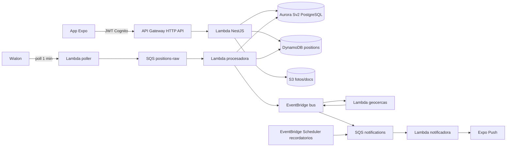

# Pet Tracker — Plan de implementación (arquitectura serverless AWS)

Generado por el skill improve el 2026-07-28. Proyecto greenfield: el directorio del repo está vacío; no existe git todavía (el plan 001 lo inicializa). Fuentes de verdad del producto:

- `C:\Users\alex\Downloads\Pet Tracker Brief (1).md` — brief maestro (producto, módulos, MVP §20, criterio de éxito §23). El plan 001 lo copia a `docs/brief.md` para que el repo sea autosuficiente.
- `C:\Users\alex\Documents\Arquirtecturas_Serverless.pdf` — material de referencia serverless AWS (patrón API Gateway → Lambda → SQS/SNS/EventBridge → DynamoDB/S3/RDS).

Regla del brief (§22): **no programar el producto sin aprobación previa** de supuestos, alcance, modelo de datos, arquitectura y endpoints. Por eso el plan 001 produce el paquete de diseño y se detiene hasta que el usuario apruebe.

## Decisiones de arquitectura (servicios elegidos)

El brief fija producto y frameworks (Expo, NestJS monolito modular, PostgreSQL, Wialon, OpenAI). La instrucción del usuario fija la infraestructura: serverless en AWS, escalable, siguiendo el patrón del PDF. Resultado:

| Necesidad | Servicio elegido | Por qué | Alternativa descartada |
|---|---|---|---|
| API backend | **AWS Lambda** (Node.js 20, NestJS vía `@codegenie/serverless-express`) detrás de **API Gateway HTTP API** | Mantiene el "monolito modular NestJS" del brief con escalado automático y pago por uso. Un solo deployable para la API síncrona | Fargate/ECS (no serverless puro, coste fijo); una Lambda por endpoint (fragmenta el monolito que pide el brief) |
| Autenticación | **Amazon Cognito** User Pool + JWT authorizer en API Gateway | Registro, verificación de email, recuperación de contraseña y tokens gestionados; cero código de contraseñas propio (brief §6, §19) | Auth propia en NestJS (más código, más riesgo) |
| BD de dominio | **Aurora Serverless v2 (PostgreSQL 16)** con **RDS Data API** + Drizzle ORM | El brief exige PostgreSQL; Serverless v2 escala a 0 ACU en reposo (coste ~0 en dev) y la Data API elimina el problema de pool de conexiones desde Lambda (sin VPC) | RDS clásico (coste fijo, pooling); Neon/Supabase (fuera de AWS, se registra como plan B de coste) |
| Telemetría GPS | **DynamoDB** (tabla `positions`, on-demand, TTL) | Serie temporal de alto volumen (una mascota ≈ 2 880 posiciones/día a 30 s); en Postgres degradaría. Patrón del PDF | Timescale/Postgres particionado (operación manual) |
| Ingesta Wialon | **EventBridge Scheduler** (poller cada minuto) → Lambda → **SQS** → Lambda procesadora | Absorbe picos, reintentos automáticos y DLQ (patrón del PDF). Webhook push de Wialon queda como mejora posterior | Webhook directo síncrono (acopla Wialon al procesamiento, sin buffer) |
| Eventos de negocio | **Amazon EventBridge** (bus `pet-tracker`) | `position.updated`, `geofence.exited`, `battery.low`… desacopla motor de geocercas, alertas y tiempo real (PDF) | SNS puro (sin filtrado por reglas de contenido) |
| Push móvil | **Expo Push Notifications** (desde Lambda notificadora, cola SQS delante) | La app es Expo: integración nativa, gratuito, un solo token por dispositivo. El brief lo dejaba "por definir" | SNS Mobile Push (exige certificados FCM/APNs propios; útil solo si se abandona Expo) |
| Recordatorios | **EventBridge Scheduler** (schedules one-shot por recordatorio → SQS notificaciones) | Programación serverless exacta por vacuna/medicamento sin cron propio | Cron cada minuto contra la BD (más simple pero escanea siempre; se reevalúa si Scheduler complica) |
| Archivos | **S3** (fotos de mascota, documentos médicos) con URLs prefirmadas + CloudFront después | El brief lo dejaba "por definir"; estándar serverless | — |
| Tiempo real | **API Gateway WebSocket API** + tabla de conexiones en DynamoDB (fase 010; el MVP usa polling) | Opción serverless del "WebSockets o equivalente" del brief | AppSync (GraphQL innecesario aquí); IoT Core (sobredimensionado) |
| Mapas | **Google Maps Platform** en la app (`react-native-maps`) + Geocoding API desde backend para "dirección literal" | Primera opción del brief; geocoding inverso servidor-lado | Mapbox (válido; requiere dev client en Expo); Amazon Location (menos familiar, se anota como alternativa) |
| IA | **API de OpenAI solo desde backend** (clave en SSM), motor de reglas determinístico primero | Mandato explícito del brief (§9, §16): la IA explica, las reglas calculan | Llamadas desde la app (prohibido por brief §19) |
| Secretos | **SSM Parameter Store** (SecureString) | Gratis en tier estándar (Secrets Manager cobra por secreto); claves Wialon/OpenAI/Maps solo backend (brief §19) | Secrets Manager (coste sin beneficio aquí) |
| IaC | **AWS CDK v2 en TypeScript** | Todo el stack es TypeScript; infraestructura tipada y revisable | SAM/Serverless Framework (menos expresivos para Cognito+Aurora+Scheduler) |

Flujo completo (idéntico al "patrón al completo" del PDF, aplicado al dominio):

## Orden de ejecución y estado

Cada ejecutor: lee el plan completo antes de empezar, respeta sus condiciones de STOP y actualiza su fila al terminar. Commits: conventional commits en inglés, un commit por feature completada (preferencia del usuario).

| Plan | Título | Prioridad | Esfuerzo | Depende de | Estado |
|------|--------|-----------|----------|------------|--------|
| 001 | Paquete de diseño y gate de aprobación | P1 | M | — | DONE |
| 002 | Fundaciones: monorepo, CDK e infraestructura dev | P1 | L | 001 **aprobado por el usuario** | DONE (adaptado: infra local en LocalStack; stack CDK dev real llegó con feature #20) |
| 003 | Autenticación y usuarios (Cognito) | P1 | M | 002 | DONE (deviación: auth propia JWT en local, sin Cognito; swap preparado en el guard) |
| 004 | Mascotas: CRUD, fotos y permisos por mascota | P1 | M | 003 | DONE |
| 005 | Collar GPS: asociación, ingesta Wialon y última posición | P1 | L | 004 | DONE |
| 006 | Recorridos, validación de posiciones y actividad | P1 | M | 005 | DONE |
| 007 | Geocercas, motor de alertas y push | P1 | L | 006 | DONE |
| 008 | Salud: vacunas, peso y recordatorios | P1 | M | 004 (y 007 para push) | IN PROGRESS (vacunas #14 y peso #15 done; recordatorios #16 pending) |
| 009 | Alimentación: motor de reglas + explicación IA | P1 | M | 004 | TODO |
| 010 | Endurecimiento, tiempo real (WebSocket) y observabilidad | P2 | M | 007 | TODO |
| 011 | Mapa de arquitectura AWS en Excalidraw (dev actual + objetivo prod) | P2 | S | — | DONE (revisado 2026-08-11; commit a7b868c en branch docs/architecture-map, worktree del ejecutor — pendiente de merge por humano) |
| 012 | Validación de escalabilidad y costos de la arquitectura serverless | P2 | M | — | DONE (revisado 2026-08-11; commit 37c44ed en branch docs/aws-scalability-review, worktree del ejecutor — pendiente de merge por humano; veredicto del doc: GO con condiciones) |

Estados: TODO | IN PROGRESS | DONE | BLOCKED (con motivo de una línea) | REJECTED (con justificación de una línea).

## Notas de dependencias

- 002 requiere 001 porque el brief (§22) exige aprobación humana del diseño antes de programar; 002 despliega infraestructura que cuesta dinero real.
- 005 requiere 004 porque la asociación de collar cuelga de una mascota existente con guard de permisos.
- 006 requiere 005 porque los recorridos consumen la tabla `positions` que llena la ingesta.
- 007 requiere 006 porque el motor de geocercas escucha `position.updated` con posiciones ya validadas.
- 008 y 009 solo requieren 004 para su parte de datos; los recordatorios push de 008 necesitan la Lambda notificadora creada en 007. Pueden ejecutarse en paralelo con 005–007 si hay dos ejecutores (008 deja los push en modo log hasta que exista 007).
- El MVP del brief (§20) queda cubierto al completar 001–009; 010 es post-MVP temprano.
- 011 y 012 son independientes entre sí y de 009/010; pueden ejecutarse en paralelo y no tocan código de aplicación (solo `docs/`).

## Reconciliación 2026-08-11

Estados 001–010 actualizados contra `feature_list.json` (features 1–15 y 19–21 done; 16–18 pending). La fase "AWS real" (features 19–21: AWS_MODE, stack CDK dev `infra/`, guarda de endpoint) no tenía plan numerado aquí; vive en `feature_list.json`. Planes 011–012 añadidos por invocación del skill improve (gap detectado por el usuario: sin mapa de arquitectura y sin validación formal de escalabilidad/costo). El presupuesto de producción ya existía en `plans/presupuesto-produccion.md` — 012 lo referencia, no lo duplica.

## Supuestos globales (verificados en el diseño, confirmar en 001)

1. Hay cuenta AWS con credenciales de administrador configurables en la máquina de desarrollo (`aws configure`). Región: `us-east-1`.
2. El token de la API de Wialon puede no existir aún: **todo el pipeline de ingesta se desarrolla contra un simulador** (`SIM_MODE`) y se conmuta a Wialon real por configuración. El hardware nunca bloquea.
3. Clave de OpenAI disponible antes del plan 009; si no, el plan degrada a plan alimentario sin explicación IA (flag `OPENAI_ENABLED=false`).
4. Presupuesto dev objetivo < 10 USD/mes (alarma de AWS Budgets en 002). Aurora a 0 ACU en reposo, DynamoDB/Lambda/SQS dentro de free tier a volúmenes de desarrollo.
5. Idioma: UI y textos de usuario en español; código, identificadores y commits en inglés.

## Descartado (para no re-evaluarlo)

- **DynamoDB para todo el dominio**: el brief exige PostgreSQL y el modelo (permisos por mascota, expediente, catálogos) es relacional. Solo la telemetría va a DynamoDB.
- **AWS Amplify (framework full-stack)**: oculta la arquitectura que este proyecto quiere demostrar; se usa únicamente la librería `aws-amplify` en la app para hablar con Cognito.
- **Microservicios desde el día 1**: el brief pide monolito modular en la primera etapa; los workers asíncronos ya son funciones separadas, que es el desacople que aporta valor ahora.
- **AppSync/GraphQL**: la API es REST con contrato OpenAPI exigido por el brief (§22.9).
